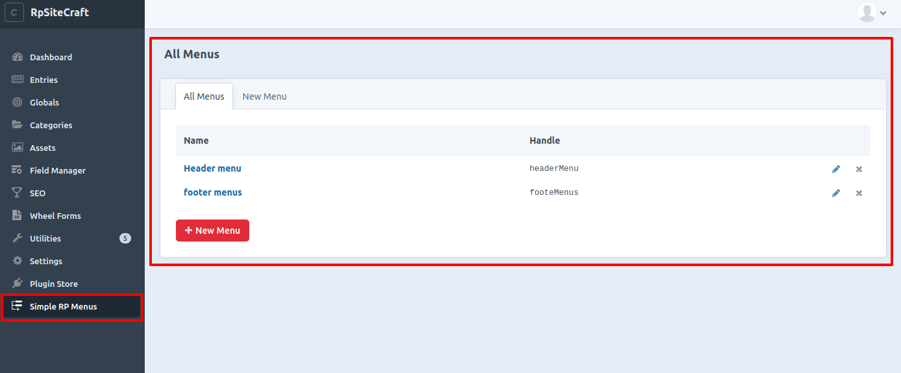
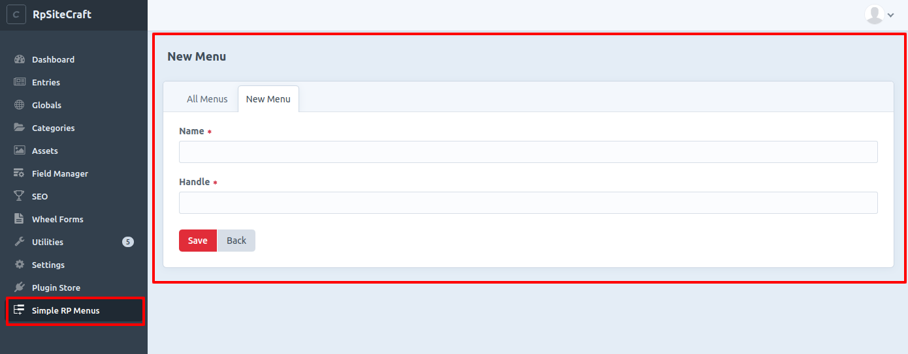
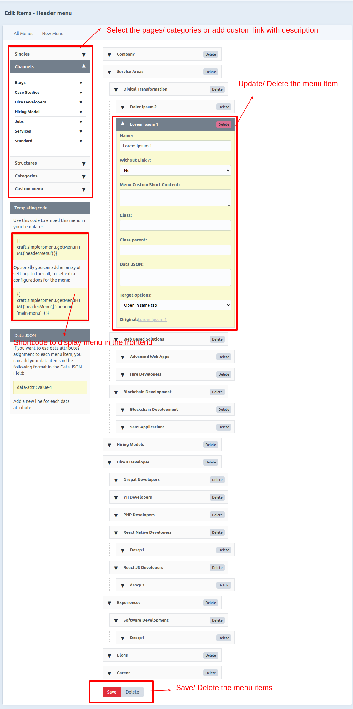

# Simple RP Menu plugin for Craft CMS 3.x

This is a simple menu to add Singles, Structures, Channels, Categories, Custom menus (with description), etc to your name menu for CRAFT CMS V3.x

## Requirements

This plugin requires Craft CMS 3.0.0-beta.23 or later.

## Installation

To install the plugin, follow these instructions.

1. Open your terminal and go to your Craft project:

        > cd /path/to/project

2. Then tell Composer to load the plugin:

        > composer require remoteprogrammer/simple-rp-menu

3. In the Control Panel, go to Settings → Plugins and click the “Install” button for Simple RP Menu.

## Simple RP Menu Overview

This is a simple menu to add Singles, Structures, Channels, Categories, Custom menus (with description), etc to your name menu for CRAFT CMS V3.x

## Configuring Simple RP Menu

1. Install plugin if not automatically installed by this console command

         cd /path/to/project
        
         ./craft plugin/install simple-rp-menu
        
## Using Simple RP Menu

1. Backend menu create url :

        SITE_URL/adminName/simplerpmenu/default
        
   a. All Menus
	   
        
   b. Add New Menu
	   
        
   c. Edit Menu items/ drag item to chage order / delete items etc
	   

2. Call this in the frontend for usage

  a. Use this code to embed this menu in your templates:

        {{ craft.simplerpmenu.getRpMenuHTML('HandleName') }}
  
  b. Optionally you can add an array of settings to the call, to set extra configurations for the menu:

        {{ craft.simplerpmenu.getRpMenuHTML('HandleName',{ 'menu-id': 'main-menu' }) }}
        
        {{ craft.simplerpmenu.getRpMenuHTML('HandleName',{ 'menu-id': 'headerMenu','menu-class':'menuGroup','ul-class':'navbar-nav justify-content-end','li-class':'nav-item','sub-menu-ul-class':'container mega-menu px-0 px-lg-_5 px-xl-1_5' }) }}

Brought to you by [Bedh Prakash](https://github.com/bedh-rp)
